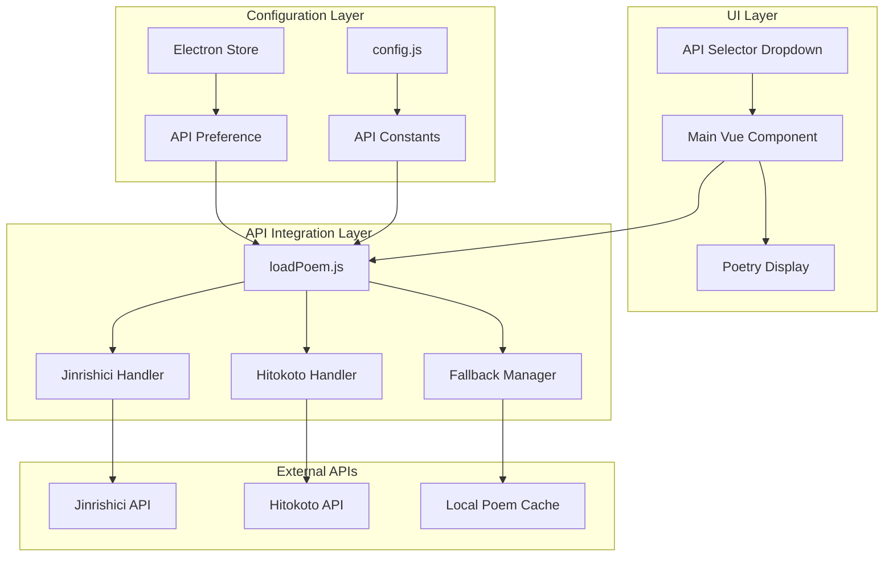
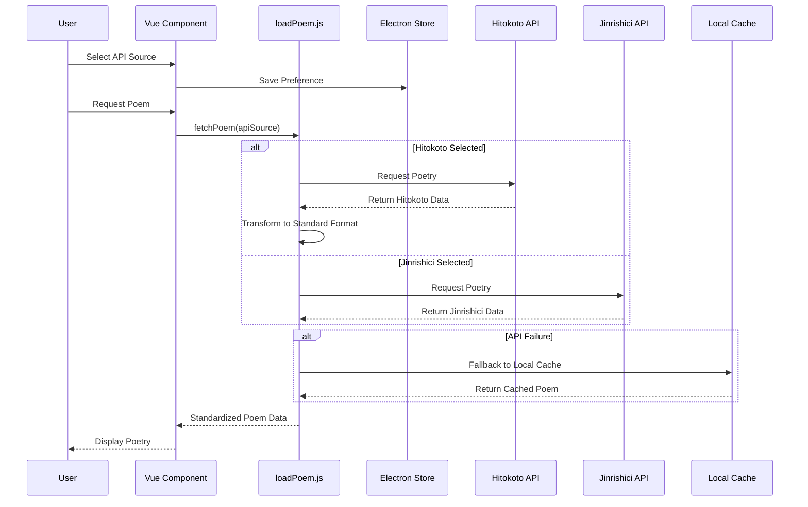
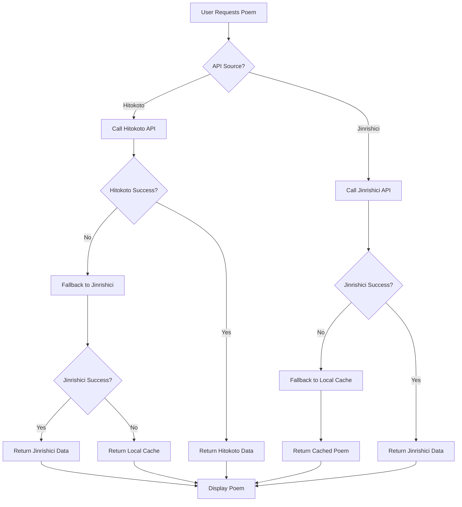

# Hitokoto API Integration Epic

## Overview

This epic introduces dual poetry API support to ZenWaves, enabling users to choose between the existing Jinrishici API and the new Hitokoto API for poetry content. The integration maintains complete backward compatibility while providing users with access to Hitokoto's extensive collection of Chinese poetry from verified authors.

### Business Value
- **Enhanced Content Diversity**: Access to Hitokoto's curated poetry collection with verified authors like 郑燮 and 李清照
- **User Choice**: Flexible API selection with persistent preferences
- **Improved Reliability**: Additional fallback option through dual API support
- **Zero Disruption**: Complete backward compatibility ensures existing workflows remain unchanged

### Target Users
- Existing ZenWaves users seeking content variety
- Poetry enthusiasts preferring specific API sources
- Users experiencing connectivity issues with single API dependency

## Architecture

### System Components



### Data Flow Architecture



## Implementation Strategy

### Phase 0: Jinrishici API Refactoring (Current Step)

Before implementing dual API support, we first need to refactor the existing Jinrishici implementation to extract hardcoded API configuration from [loadPoem.js](file:///Users/kamus/Documents/CascadeProjects/zenwaves-electron/src/components/loadPoem.js) to [config.js](file:///Users/kamus/Documents/CascadeProjects/zenwaves-electron/src/components/config.js).

**Current Issues in loadPoem.js**:
- Hardcoded API URLs: `'https://v2.jinrishici.com/one.json?client=npm-sdk/1.0'`
- Hardcoded client parameter: `client=npm-sdk/1.0`
- Fixed token key name: `'jinrishici-token'`
- No timeout configuration
- Limited configurability

**Refactoring Goals**:
1. **Extract API Configuration**: Move all Jinrishici API parameters to config.js
2. **Centralize Constants**: Create a single source of truth for API settings
3. **Improve Maintainability**: Make API endpoints and parameters easily configurable
4. **Prepare for Dual API**: Establish configuration pattern for future Hitokoto integration

**Configuration Structure to Add to config.js**:
```javascript
// Content API Configuration (unified structure from Phase 0)
export const CONTENT_API_CONFIG = {
  jinrishici: {
    baseUrl: 'https://v2.jinrishici.com',
    endpoint: '/one.json',
    clientId: 'npm-sdk/1.0',
    tokenKey: 'jinrishici-token',
    timeout: 5000,
    withCredentials: true
  }
  // Hitokoto config will be added in Phase 1
};
```

**Updated loadPoem.js Implementation**:
```javascript
import { DEFAULT_POEM_ARRAY, CONTENT_API_CONFIG } from './config'

// Extract Jinrishici logic into dedicated function
const loadFromJinrishici = (callback) => {
  const config = CONTENT_API_CONFIG.jinrishici;
  const keyName = config.tokenKey;
  
  if (window.localStorage && window.localStorage.getItem(keyName)) {
    return commonLoad(callback, window.localStorage.getItem(keyName), config);
  } else {
    return corsLoad(callback, config);
  }
};

// Refactored helper functions to use config
const corsLoad = (callback, config) => {
  const newCallBack = function (result) {
    window.localStorage.setItem(config.tokenKey, result.token);
    callback(result);
  };
  const apiUrl = `${config.baseUrl}${config.endpoint}?client=${config.clientId}`;
  return sendRequest(newCallBack, apiUrl);
};

const commonLoad = (callback, token, config) => {
  const apiUrl = `${config.baseUrl}${config.endpoint}?client=${config.clientId}&X-User-Token=${encodeURIComponent(token)}`;
  return sendRequest(callback, apiUrl);
};

// Main loadPoem function (Phase 0: unchanged behavior)
const loadPoem = (callback) => {
  return loadFromJinrishici(callback);
};
```

**Benefits of This Approach**:
- **Single Source of Truth**: All content API configuration in one place
- **Easy Maintenance**: Change endpoints without touching business logic
- **Testability**: Mock configuration for testing
- **Future-Ready**: Extensible structure for additional APIs
- **No Refactoring**: Direct path from Phase 0 to Phase 1 without intermediate changes
- **Clear Naming**: CONTENT_API_CONFIG clearly indicates purpose (poetry, quotes, etc.)

### Phase 1: Dual API Support Implementation

After Phase 0 refactoring, implement the dual API support with the following phases:

**Phase 1a: Configuration Extension**
- Extend CONTENT_API_CONFIG with Hitokoto configuration
- Add API selection constants
- Maintain backward compatibility

```javascript
// Phase 1: Extend existing CONTENT_API_CONFIG
export const CONTENT_API_CONFIG = {
  jinrishici: {
    baseUrl: 'https://v2.jinrishici.com',
    endpoint: '/one.json',
    clientId: 'npm-sdk/1.0',
    tokenKey: 'jinrishici-token',
    timeout: 5000,
    withCredentials: true
  },
  hitokoto: {
    baseUrl: 'https://v1.hitokoto.cn',
    params: {
      category: 'i',
      encode: 'json',
      minLength: 5,
      maxLength: 25
    },
    timeout: 5000,
    withCredentials: false
  }
};
```

**Phase 1b: loadPoem.js Enhancement**
- Add `loadFromHitokoto` function (parallel to existing `loadFromJinrishici`)
- Implement API selection logic in main `loadPoem` function
- Add cross-API fallback mechanism

```javascript
// NEW: Add Hitokoto integration function
const loadFromHitokoto = (callback, errorCallback) => {
  const config = CONTENT_API_CONFIG.hitokoto;
  const params = new URLSearchParams(config.params);
  const apiUrl = `${config.baseUrl}?${params.toString()}`;
  
  fetch(apiUrl)
    .then(response => response.json())
    .then(hitokoto => {
      // Transform to ZenWaves format
      const zenWavesFormat = {
        status: "success",
        data: {
          content: hitokoto.hitokoto,
          origin: {
            author: hitokoto.from_who || "佚名",
            title: hitokoto.from || "未知作品"
          }
        },
        source: "hitokoto"
      };
      callback(zenWavesFormat);
    })
    .catch(error => {
      console.error('Hitokoto API failed:', error);
      if (errorCallback) errorCallback(error);
    });
};

// MODIFY: Enhanced main function with API selection
const loadPoem = (callback, options = {}) => {
  const { apiSource = 'jinrishici' } = options;
  
  if (apiSource === 'hitokoto') {
    loadFromHitokoto(callback, () => {
      // Fallback to Jinrishici if Hitokoto fails
      loadFromJinrishici(callback);
    });
  } else {
    // Default Jinrishici behavior
    loadFromJinrishici(callback);
  }
};
```

**Phase 1c: UI Integration**
- Add API selector dropdown to index.vue
- Implement state management for API selection
- Add Electron Store persistence

### 1. API Selection UI Component
**Location**: `/src/components/index.vue`

**Responsibilities**:
- Render API selection dropdown
- Handle user selection events
- Persist API preference via Electron Store
- Trigger poem refresh on API change

**State Management**:
```javascript
const wallpaperParams = reactive({
  // ... existing properties
  apiSource: 'jinrishici' // Default API selection
});
```

### 2. Dual API Handler
**Location**: `/src/components/loadPoem.js`

**Responsibilities**:
- Provide dedicated API integration functions (`loadFromJinrishici`, `loadFromHitokoto`)
- Route requests to appropriate API based on user selection
- Transform API responses to unified format
- Manage fallback chain across APIs

**Architecture Pattern**:
```javascript
// Phase 0: Single API with dedicated function
const loadPoem = (callback) => {
  return loadFromJinrishici(callback);
};

// Phase 1: Dual API with selection
const loadPoem = (callback, options = {}) => {
  const { apiSource = 'jinrishici' } = options;
  
  if (apiSource === 'hitokoto') {
    loadFromHitokoto(callback, () => {
      // Cross-API fallback
      loadFromJinrishici(callback);
    });
  } else {
    loadFromJinrishici(callback);
  }
};
```

**Key Benefits**:
- **Clear API Separation**: Each API has its own dedicated function
- **Consistent Interface**: Both functions follow same callback pattern
- **Easy Testing**: Mock individual API functions independently
- **Maintainable**: Changes to one API don't affect the other

### 3. Configuration Management (Phase 0 - Current Focus)
**Location**: `/src/components/config.js`

**Current State Analysis**:
The existing [config.js](file:///Users/kamus/Documents/CascadeProjects/zenwaves-electron/src/components/config.js) contains:
- `INTERVAL_OPTIONS` for wallpaper change intervals
- `FONT_OPTIONS` for font selections  
- `DEFAULT_POEM_ARRAY` for fallback poetry

**Missing Configuration**:
- Jinrishici API parameters are hardcoded in [loadPoem.js](file:///Users/kamus/Documents/CascadeProjects/zenwaves-electron/src/components/loadPoem.js)

**Required Changes to config.js**:
```javascript
// Content API Configuration (Phase 0 - Unified Structure)
export const CONTENT_API_CONFIG = {
  jinrishici: {
    baseUrl: 'https://v2.jinrishici.com',
    endpoint: '/one.json',
    clientId: 'npm-sdk/1.0',
    tokenKey: 'jinrishici-token',
    timeout: 5000,
    withCredentials: true
  }
  // Hitokoto config will be added in Phase 1
};

// Future: API Selection Options (Phase 1)
export const API_OPTIONS = [
  { label: 'Jinrishici (今日诗词)', value: 'jinrishici' },
  { label: 'Hitokoto (一言)', value: 'hitokoto' }
];

export const DEFAULT_API = 'jinrishici';
```

**Required Changes to loadPoem.js**:
```javascript
// Current import
import { DEFAULT_POEM_ARRAY } from './config'

// New import (Phase 0)
import { DEFAULT_POEM_ARRAY, CONTENT_API_CONFIG } from './config'

// NEW: Extract Jinrishici logic into dedicated function
const loadFromJinrishici = (callback) => {
  const config = CONTENT_API_CONFIG.jinrishici;
  const keyName = config.tokenKey;
  
  if (window.localStorage && window.localStorage.getItem(keyName)) {
    return commonLoad(callback, window.localStorage.getItem(keyName), config);
  } else {
    return corsLoad(callback, config);
  }
};

// MODIFY: Update helper functions to accept config parameter
const corsLoad = (callback, config) => {
  const newCallBack = function (result) {
    window.localStorage.setItem(config.tokenKey, result.token);
    callback(result);
  };
  const apiUrl = `${config.baseUrl}${config.endpoint}?client=${config.clientId}`;
  return sendRequest(newCallBack, apiUrl);
};

const commonLoad = (callback, token, config) => {
  const apiUrl = `${config.baseUrl}${config.endpoint}?client=${config.clientId}&X-User-Token=${encodeURIComponent(token)}`;
  return sendRequest(callback, apiUrl);
};

// MODIFY: Main function now delegates to dedicated function
const loadPoem = (callback) => {
  return loadFromJinrishici(callback);
};
```

**Why This Approach**:
- ✅ **Clear Separation**: Dedicated `loadFromJinrishici` function
- ✅ **Future Ready**: Easy to add `loadFromHitokoto` in Phase 1
- ✅ **Configurable**: Helper functions accept config parameters
- ✅ **No Breaking Changes**: Main `loadPoem` function maintains same interface

**Phase 0 Validation**:
- ✅ No functional changes to existing behavior
- ✅ Same API calls with configurable parameters
- ✅ Maintains backward compatibility
- ✅ Prepares foundation for dual API support

## API Endpoints Reference

### Hitokoto API Integration

**Endpoint**: `https://v1.hitokoto.cn/?c=i&encode=json&min_length=5&max_length=25`

**Request Parameters**:
- `c=i`: Poetry category filter
- `encode=json`: JSON response format
- `min_length=5`: Minimum content length
- `max_length=25`: Maximum content length

**Response Schema**:
```json
{
  "id": 7409,
  "uuid": "550e8400-e29b-41d4-a716-446655440000",
  "hitokoto": "落红不是无情物，化作春泥更护花",
  "type": "i",
  "from": "己亥杂诗·其五",
  "from_who": "龚自珍",
  "creator": "a-wing",
  "creator_uid": 910,
  "reviewer": 1044,
  "commit_from": "web",
  "created_at": "1468405090",
  "length": 16
}
```

### Data Model Mapping

**Hitokoto to ZenWaves Transformation**:
```javascript
const zenWavesFormat = {
  status: "success",
  data: {
    content: hitokoto.hitokoto,
    origin: {
      author: hitokoto.from_who || "佚名",
      title: hitokoto.from || "未知作品"
    }
  },
  source: "hitokoto"
};
```

**Unified Response Format**:
```typescript
interface PoemResult {
  status: 'success' | 'error';
  data: {
    content: string;        // Main poem line
    origin: {
      author: string;       // Author name
      title: string;        // Poem title
    };
  };
  source: 'jinrishici' | 'hitokoto' | 'local';
}
```

## Business Logic Layer

### API Selection Strategy

**Priority Chain**:
1. **User Selection**: Persisted API preference from Electron Store
2. **Default Fallback**: Jinrishici API (maintains existing behavior)
3. **Error Recovery**: Cross-API fallback for reliability
4. **Local Cache**: Final fallback to cached poems

### Fallback Mechanism



### State Persistence

**Electron Store Integration**:
```javascript
// Save API preference
window.electronAPI.store.set('wallpaperParams.apiSource', selectedAPI);

// Load API preference on startup
const savedAPI = window.electronAPI.store.get('wallpaperParams.apiSource', 'jinrishici');
```

## Middleware & Interceptors

### Error Handling Middleware

**API Request Wrapper**:
```javascript
const apiRequestWithFallback = (primaryAPI, fallbackAPI, callback) => {
  primaryAPI()
    .then(result => callback(result))
    .catch(error => {
      console.warn(`Primary API failed: ${error.message}`);
      return fallbackAPI();
    })
    .then(result => callback(result))
    .catch(error => {
      console.error(`All APIs failed: ${error.message}`);
      // Return local fallback
      callback(getLocalFallback());
    });
};
```

### Response Transformation Middleware

**Standardization Layer**:
```javascript
const transformResponse = (apiResponse, source) => {
  switch (source) {
    case 'hitokoto':
      return transformHitokotoResponse(apiResponse);
    case 'jinrishici':
      return transformJinrishiciResponse(apiResponse);
    default:
      return apiResponse;
  }
};
```

## Testing Strategy

### Phase 0 Testing: Jinrishici Refactoring Validation

**Pre-Refactoring Baseline**:
```javascript
// Test current loadPoem functionality
describe('Jinrishici API - Before Refactoring', () => {
  test('should load poem with existing implementation', (done) => {
    loadPoem((result) => {
      expect(result.status).toBe('success');
      expect(result.data.content).toBeDefined();
      expect(result.data.origin.author).toBeDefined();
      done();
    });
  });
});
```

**Post-Refactoring Validation**:
```javascript
// Test refactored loadPoem functionality
describe('Jinrishici API - After Config Extraction', () => {
  test('should maintain same functionality with config', (done) => {
    loadPoem((result) => {
      expect(result.status).toBe('success');
      expect(result.data.content).toBeDefined();
      expect(result.data.origin.author).toBeDefined();
      done();
    });
  });
  
  test('should use configuration from config.js', () => {
    expect(CONTENT_API_CONFIG.jinrishici.baseUrl).toBe('https://v2.jinrishici.com');
    expect(CONTENT_API_CONFIG.jinrishici.tokenKey).toBe('jinrishici-token');
  });
  
  test('should build correct API URLs', () => {
    const config = CONTENT_API_CONFIG.jinrishici;
    const expectedUrl = `${config.baseUrl}${config.endpoint}?client=${config.clientId}`;
    expect(expectedUrl).toBe('https://v2.jinrishici.com/one.json?client=npm-sdk/1.0');
  });
});
```

**Configuration Testing**:
```javascript
describe('Configuration Validation', () => {
  test('CONTENT_API_CONFIG should be properly exported', () => {
    expect(CONTENT_API_CONFIG).toBeDefined();
    expect(CONTENT_API_CONFIG.jinrishici).toBeDefined();
    expect(CONTENT_API_CONFIG.jinrishici.baseUrl).toMatch(/^https?:\/\/.+/);
    expect(CONTENT_API_CONFIG.jinrishici.endpoint).toMatch(/^\/.*/);
  });
});
```

### Unit Testing

**API Integration Tests**:
```javascript
describe('Hitokoto API Integration', () => {
  test('should fetch and transform Hitokoto poetry', async () => {
    const mockResponse = {
      hitokoto: "落红不是无情物，化作春泥更护花",
      from_who: "龚自珍",
      from: "己亥杂诗·其五"
    };
    
    const result = await loadFromHitokoto();
    expect(result.data.content).toBe(mockResponse.hitokoto);
    expect(result.data.origin.author).toBe(mockResponse.from_who);
  });
});
```

**Fallback Mechanism Tests**:
```javascript
describe('API Fallback Chain', () => {
  test('should fallback to Jinrishici when Hitokoto fails', async () => {
    // Mock Hitokoto failure
    jest.spyOn(global, 'fetch').mockRejectedValueOnce(new Error('Network error'));
    
    const result = await loadPoem(callback, { apiSource: 'hitokoto' });
    expect(result.source).toBe('jinrishici');
  });
});
```

### Integration Testing

**End-to-End User Flow**:
1. User selects Hitokoto API from dropdown
2. Preference is saved to Electron Store
3. New poem is fetched from Hitokoto API
4. Poem displays correctly in UI
5. Selection persists across application restarts

### Backward Compatibility Testing

**Legacy Behavior Validation**:
```javascript
describe('Backward Compatibility', () => {
  test('should maintain default Jinrishici behavior', () => {
    // Call without options parameter
    loadPoem(callback);
    expect(lastAPICall).toBe('jinrishici');
  });
  
  test('should preserve existing UI functionality', () => {
    // Test all existing UI interactions remain unchanged
  });
});
```

## Configuration and Customization

### Centralized API Configuration

**Configuration Strategy**:
All API parameters are centralized in `/src/components/config.js` for easy maintenance and customization. This approach allows developers to modify API endpoints, timeouts, and parameters without touching the core logic.

**Jinrishici Configuration**:
```javascript
jinrishici: {
  baseUrl: 'https://v2.jinrishici.com',
  endpoint: '/one.json',
  tokenKey: 'jinrishici-token',
  timeout: 5000,
  retryAttempts: 2
}
```

**Benefits of Configurable Parameters**:
- **Maintainability**: Single source of truth for API settings
- **Flexibility**: Easy endpoint switching for testing or alternative services
- **Performance Tuning**: Adjustable timeout and retry settings
- **Token Management**: Centralized authentication key handling

**Hitokoto Configuration**:
```javascript
hitokoto: {
  baseUrl: 'https://v1.hitokoto.cn',
  params: {
    category: 'i',           // Poetry category filter
    encode: 'json',          // Response format
    minLength: 5,            // Minimum content length
    maxLength: 25            // Maximum content length
  },
  timeout: 5000,
  retryAttempts: 2
}
```

### Implementation in loadPoem.js

**Configuration Usage Pattern**:
```javascript
import { API_CONFIG } from './config.js';

// Dedicated function approach
const loadFromJinrishici = (callback) => {
  const config = CONTENT_API_CONFIG.jinrishici;
  const keyName = config.tokenKey;
  
  if (window.localStorage && window.localStorage.getItem(keyName)) {
    return commonLoad(callback, window.localStorage.getItem(keyName), config);
  } else {
    return corsLoad(callback, config);
  }
};

const loadFromHitokoto = (callback, errorCallback) => {
  const config = CONTENT_API_CONFIG.hitokoto;
  const params = new URLSearchParams(config.params);
  const apiUrl = `${config.baseUrl}?${params.toString()}`;
  
  // Use configured timeout
  const controller = new AbortController();
  const timeoutId = setTimeout(() => controller.abort(), config.timeout);
  
  fetch(apiUrl, { signal: controller.signal })
    .then(response => response.json())
    .then(data => {
      clearTimeout(timeoutId);
      callback(transformHitokotoResponse(data));
    })
    .catch(error => {
      clearTimeout(timeoutId);
      if (errorCallback) errorCallback(error);
    });
};
```

### User Customization

**Available Options**:
1. **API Source Selection**: Choose between Jinrishici and Hitokoto
2. **Automatic Fallback**: Enable/disable cross-API fallback
3. **Preference Persistence**: Automatic saving of API selection

### Runtime Configuration Access

**Dynamic Configuration Updates**:
```javascript
// Allow runtime configuration updates (future enhancement)
const updateAPIConfig = (apiName, newConfig) => {
  API_CONFIG[apiName] = { ...API_CONFIG[apiName], ...newConfig };
};

// Example: Update timeout for better performance
updateAPIConfig('jinrishici', { timeout: 3000 });
```