## 🎯 **Overall Design Architecture**

### **Online Poem Database**
[chinese-poetry](https://github.com/chinese-poetry/chinese-poetry)

### **Core Design Principles**
1. **Seamless Integration** - Maintain compatibility with existing [`loadPoem.js`](file:///Users/kamus/Documents/CascadeProjects/zenwaves-electron/src/components/loadPoem.js) interface
2. **Performance First** - Fast local search with minimal memory footprint
3. **Intelligent Selection** - Smart algorithm to choose the most beautiful poem lines
4. **Graceful Degradation** - Fallback to existing APIs if local data fails
5. **TypeScript Compliance** - Follow ZenWaves' strict TypeScript standards

## 🏗️ **System Architecture**

```mermaid
graph TB
    A[User Search Input] --> B[Poetry Search Engine]
    B --> C[Local Database]
    C --> D[Format Transformer]
    D --> E[Line Selector Algorithm]
    E --> F[ZenWaves Format Output]
    
    B --> G[Search Indexes]
    G --> H[Author Index]
    G --> I[Title Index]
    G --> J[Content Index]
    
    F --> K[Existing loadPoem Interface]
    K --> L[Vue Component Display]
```



## 📊 **Data Structure Design**

### **1. Source Data Processing**
**Chinese-Poetry Raw Format:**
```json
{
  "author": "刘禹锡",
  "title": "蜀先主庙",
  "paragraphs": ["天地英雄气，千秋尚凛然。", "势分三足鼎，业复五铢钱。"],
  "prologue": "..."
}
```

**Enhanced Internal Format:**
```json
{
  "id": "unique_hash_id",
  "author": "刘禹锡",
  "title": "蜀先主庙", 
  "dynasty": "唐代",           // Inferred from author/era
  "paragraphs": ["天地英雄气，千秋尚凛然。", "势分三足鼎，业复五铢钱。"],
  "prologue": "...",
  "searchTerms": ["刘禹锡", "蜀先主庙", "天地", "英雄", "千秋"],  // Pre-computed
  "bestLines": [0, 2],        // Pre-selected best line indexes
  "popularity": 850000        // Calculated score
}
```

### **2. Search Index Structure**
```javascript
const searchIndexes = {
  authors: {
    "刘禹锡": ["poem_id_1", "poem_id_2", ...],
    "王建": ["poem_id_3", "poem_id_4", ...]
  },
  titles: {
    "蜀先主庙": "poem_id_1",
    "新嫁娘": "poem_id_3"
  },
  keywords: {
    "春": ["poem_id_5", "poem_id_6", ...],
    "花": ["poem_id_7", "poem_id_8", ...]
  }
}
```

## 🔍 **Search Engine Design**

### **Multi-Layer Search Strategy**

**1. Exact Match (Priority 1)**
- Author exact match: `searchByAuthor("刘禹锡")`
- Title exact match: `searchByTitle("蜀先主庙")`

**2. Fuzzy Match (Priority 2)**
- Partial author names: `"刘" → finds "刘禹锡", "刘备"`
- Partial titles: `"蜀" → finds "蜀先主庙", "蜀道难"`

**3. Content Search (Priority 3)**
- Keyword in poem lines: `"英雄" → finds poems containing "英雄"`
- Multi-keyword search: `"春 花" → finds poems with both terms`

**4. Semantic Search (Priority 4)**
- Related terms: `"春天" → also finds "春", "花开", "柳绿"`

### **Search Algorithm Workflow**
```javascript
const searchWorkflow = {
  1. "Parse input query (detect if it's author, title, or keywords)",
  2. "Check exact matches first",
  3. "Apply fuzzy matching if no exact results",
  4. "Rank results by relevance score",
  5. "Apply line selection algorithm",
  6. "Transform to ZenWaves format"
}
```

## 🎨 **Intelligent Line Selection Algorithm**

### **Selection Criteria (Weighted)**
1. **Literary Beauty** (40%) - Poetic devices, imagery, rhythm
2. **Semantic Completeness** (25%) - Complete thoughts, not fragments
3. **Length Appropriateness** (20%) - 7-16 characters ideal for display
4. **Cultural Significance** (15%) - Famous lines, oft-quoted verses

### **Algorithm Logic**
```javascript
const lineSelectionCriteria = {
  beauty: {
    hasImagery: +15,      // Contains nature/emotional imagery
    hasParallelism: +10,  // 对偶/parallel structure
    hasRhyme: +8,         // Rhythmic quality
    hasMetaphor: +12      // Metaphorical language
  },
  completeness: {
    isCompleteSentence: +20,
    avoidsPronouns: +10,
    standsAlone: +15
  },
  length: {
    ideal7to12chars: +20,
    acceptable5to16chars: +10,
    tooShortOrLong: -10
  }
}
```

## 🔄 **Data Transformation Pipeline**

### **Format Conversion Strategy**
```javascript
const transformationPipeline = {
  input: "Chinese-Poetry JSON",
  steps: [
    "1. Dynasty inference (based on author + historical data)",
    "2. Search terms extraction (jieba-like segmentation)",
    "3. Best lines pre-selection",
    "4. Popularity scoring",
    "5. Index generation"
  ],
  output: "ZenWaves-compatible format"
}
```

### **Dynasty Mapping Logic**
```javascript
const dynastyMapping = {
  authors: {
    "李白": "唐代", "杜甫": "唐代", "王维": "唐代",
    "苏轼": "宋代", "李清照": "宋代", "辛弃疾": "宋代"
  },
  fallback: "根据时期推断" // Historical era inference
}
```

## 🚀 **Performance Optimization Strategy**

### **Memory Management**
- **Lazy Loading**: Load poem data on demand
- **Chunked Processing**: Process large datasets in batches
- **Index Caching**: Keep frequently accessed indexes in memory
- **Garbage Collection**: Clean up unused data periodically

### **Search Optimization**
- **Pre-computed Indexes**: Build search indexes at startup
- **Debounced Search**: Prevent excessive search calls
- **Result Caching**: Cache recent search results
- **Parallel Processing**: Use Web Workers for heavy operations

## 🔌 **Integration Points**

### **1. Existing API Compatibility**
```javascript
// Current interface in loadPoem.js
loadPoem((result) => {
  poemData.content = result.data.content    // Single line
  poemData.author = result.data.origin.author
  poemData.title = result.data.origin.title
})

// New enhanced interface (backward compatible)
loadPoem((result) => {
  // Same format, but with search capability
}, {
  searchQuery: "春",           // Optional search
  searchType: "keyword"       // "author", "title", "keyword"
})
```

### **2. UI Integration Points**
- **Search Input**: Enhance existing AI prompt input
- **Search Suggestions**: Dropdown with author/title suggestions
- **Search History**: Remember recent searches
- **Random Mode**: Fallback to random when no search query

## 📁 **File Structure Design**

```
src/components/
├── poetryDatabase.js         # Main database class
├── poetrySearch.js          # Search engine implementation
├── poetryTransformer.js     # Format conversion utilities
├── poetrySelector.js        # Line selection algorithm
├── loadPoem.js             # Enhanced (backward compatible)
└── data/
    ├── poetry-compact.json  # Processed poetry data
    ├── search-indexes.json  # Pre-built search indexes
    └── dynasty-mapping.json # Author-dynasty mappings
```

## 🎛️ **Configuration & Customization**

### **Configurable Parameters**
```javascript
const poetryConfig = {
  search: {
    maxResults: 50,
    fuzzyThreshold: 0.7,
    enableSemanticSearch: true
  },
  lineSelection: {
    preferFamousLines: true,
    idealLength: [7, 12],
    weightings: { beauty: 0.4, completeness: 0.25, length: 0.2, significance: 0.15 }
  },
  performance: {
    enableCaching: true,
    maxCacheSize: 1000,
    lazyLoadThreshold: 10000
  }
}
```

## 🔄 **Fallback Strategy**

### **Multi-Layer Fallback**
1. **Local Database** (Primary) - Fast, comprehensive search
2. **Hitokoto API** (Secondary) - If local search fails
3. **Default Poems** (Tertiary) - Existing [`config.js`](file:///Users/kamus/Documents/CascadeProjects/zenwaves-electron/src/components/config.js) fallback
4. **AI Generation** (Last Resort) - Current OpenAI integration

## 📈 **Success Metrics**

### **Performance Targets**
- **Search Response Time**: < 50ms for most queries
- **Memory Usage**: < 100MB for complete database
- **Search Accuracy**: > 95% relevance for exact matches
- **User Experience**: Seamless integration with existing UI

### **Quality Metrics**
- **Line Beauty Score**: Average > 80/100 for selected lines
- **Completeness**: > 90% of lines are semantically complete
- **Cultural Relevance**: Prefer well-known, culturally significant verses

## 🔧 **Implementation Phases**

### **Phase 1: Core Infrastructure**
1. Data processing pipeline
2. Basic search engine
3. Format transformation

### **Phase 2: Intelligence Layer**
1. Line selection algorithm
2. Search optimization
3. Fuzzy matching

### **Phase 3: Integration & Polish**
1. UI enhancements
2. Performance optimization
3. Testing & validation
