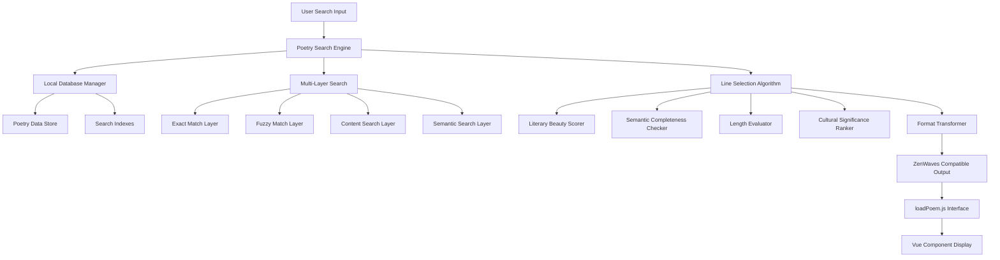
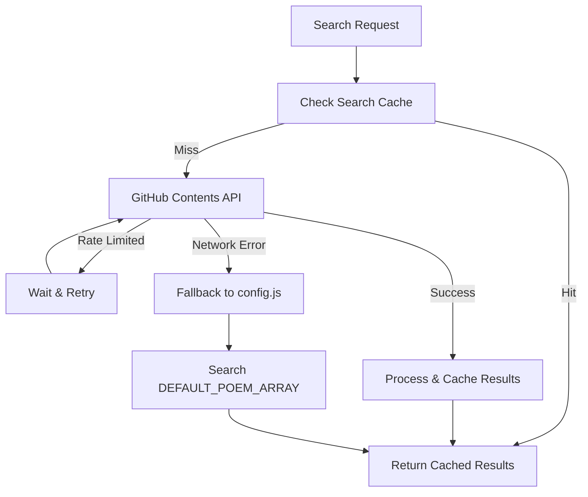
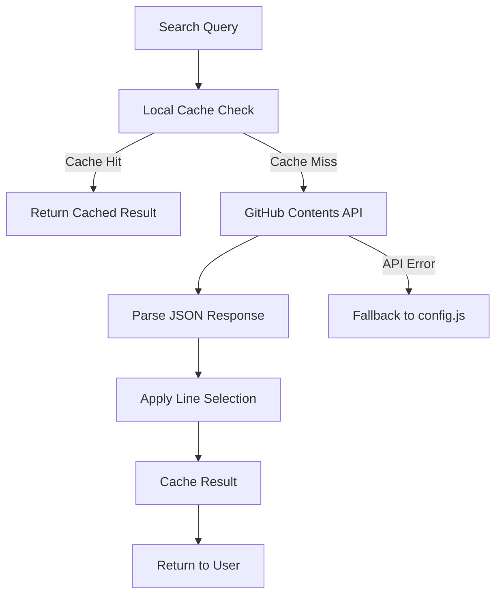
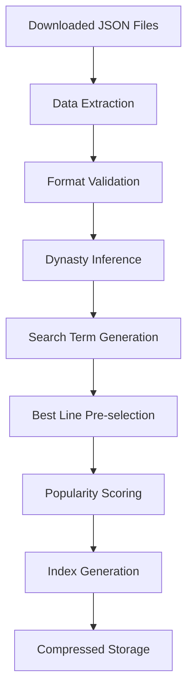
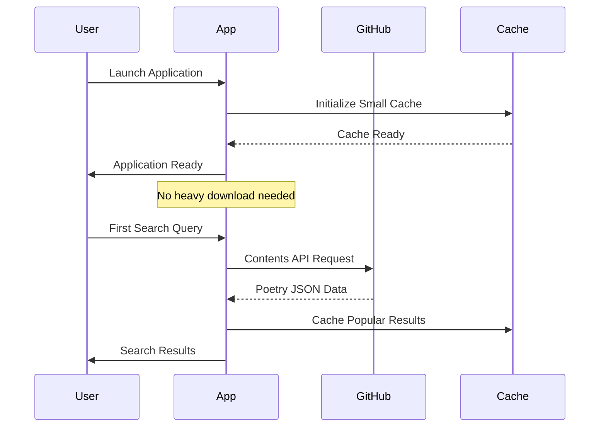

# Local Poem Database Search Feature Specification

## Overview

The Local Poem Database Search feature enhances ZenWaves Electron application with offline Chinese poetry search capabilities, providing users with intelligent poem discovery while maintaining compatibility with the existing poetry display system. This feature replaces reliance on external APIs with a comprehensive local database derived from the chinese-poetry repository.

### Key Benefits
- **Offline Access**: Complete poetry database available without internet connection
- **Intelligent Search**: Multi-layer search algorithm with semantic understanding
- **Performance**: Sub-50ms search response times with minimal memory footprint
- **Cultural Depth**: Access to comprehensive classical Chinese poetry collection
- **Seamless Integration**: Backward compatibility with existing `loadPoem.js` interface

## Technology Stack & Dependencies

### Core Technologies
- **Vue 3**: Frontend component integration
- **Electron 35.0**: Desktop application framework
- **TypeScript**: Type safety and development experience
- **P5.js**: Animation rendering compatibility

### New Dependencies
- **GitHub Contents API**: On-demand access to chinese-poetry repository
- **axios** or **node-fetch**: HTTP client for GitHub API requests
- **lru-cache**: Lightweight caching for frequently accessed poems
- **Jieba-like segmentation**: Chinese text processing for search indexing
- **Web Workers**: Background processing for search operations

## Architecture

### System Architecture Diagram



### Component Architecture

#### 1. Poetry Database Manager (`poetryDatabase.js`)
**Responsibilities:**
- Initialize and manage local poetry data storage
- Handle data loading and caching strategies
- Provide unified interface for data access
- Manage memory optimization and garbage collection

**Key Methods:**
```typescript
interface PoetryDatabaseManager {
  initialize(): Promise<void>
  getPoetryById(id: string): Poetry | null
  getAllAuthors(): string[]
  getPoetryByAuthor(author: string): Poetry[]
  getCachedResults(query: string): SearchResult[] | null
  setCachedResults(query: string, results: SearchResult[]): void
}
```

#### 2. Poetry Search Engine (`poetrySearch.js`)
**Responsibilities:**
- Execute multi-layer search algorithms
- Manage search indexes and optimization
- Handle query parsing and preprocessing
- Coordinate search result ranking

**Search Layers:**
- **Exact Match (Priority 1)**: Direct author/title matching
- **Fuzzy Match (Priority 2)**: Partial string matching with threshold
- **Content Search (Priority 3)**: Full-text search within poem content
- **Semantic Search (Priority 4)**: Context-aware keyword expansion

#### 3. Line Selection Algorithm (`poetrySelector.js`)
**Responsibilities:**
- Evaluate poetry lines using weighted criteria system
- Select most appropriate line for display
- Apply cultural significance scoring
- Ensure semantic completeness

**Selection Criteria:**
- **Literary Beauty (40%)**: Poetic devices, imagery, rhythm
- **Semantic Completeness (25%)**: Complete thoughts, standalone meaning
- **Length Appropriateness (20%)**: 7-16 characters optimal for display
- **Cultural Significance (15%)**: Famous lines, historical importance

#### 4. Format Transformer (`poetryTransformer.js`)
**Responsibilities:**
- Convert chinese-poetry format to ZenWaves format
- Enhance data with computed fields
- Maintain backward compatibility
- Handle dynasty inference and metadata enrichment

## On-Demand Poetry Access Strategy

### GitHub Contents API Integration

#### Repository Structure Access
Instead of downloading the entire repository, the system will access poetry files on-demand:
```
GitHub Contents API:
/chinese-poetry/全唐诗/poet.tang.0.json
/chinese-poetry/全宋诗/poet.song.0.json
/chinese-poetry/宋词/ci.song.0.json
```

#### Smart Search Strategy
1. **Author-based Search**: Target specific dynasty folders based on known author mappings
2. **Content Search**: Search across multiple files using parallel API calls
3. **Intelligent Caching**: Cache popular search results and frequently accessed poems
4. **Progressive Enhancement**: Start with cache, fallback to API, then to config.js samples

#### Cache Strategy
```typescript
interface SmartCache {
  // Cache layers
  searchResultsCache: LRUCache<string, SearchResult[]>  // Search query → results
  poetryFileCache: LRUCache<string, Poetry[]>         // File path → poems
  authorMappingCache: Map<string, string[]>           // Author → file paths
  
  // Cache settings
  maxSearchResults: 100     // Maximum cached search queries
  maxPoetryFiles: 50       // Maximum cached poetry files
  cacheTTL: 3600000        // 1 hour in milliseconds
}
```

#### Fallback System


## Data Models & Storage

### Source Data Structure (chinese-poetry)
```typescript
interface ChinesePoetrySource {
  author: string
  title: string
  paragraphs: string[]
  prologue?: string
  chapter?: string
  section?: string
}
```

### Lightweight Storage Strategy

#### Cache-Only Storage
```typescript
interface CacheStorage {
  // Temporary cache storage (in-memory + small persistent cache)
  searchCache: string         // Cache search results
  authorMapping: string       // Known author-to-dynasty mappings
  fallbackPoems: string       // Existing DEFAULT_POEM_ARRAY from config.js
}
```

#### Persistent Cache Structure
```typescript
interface PersistentCache {
  // Small persistent cache for popular content
  popularPoems: Map<string, Poetry>     // Frequently accessed poems
  searchHistory: SearchQuery[]          // Recent search queries
  authorMappings: Map<string, string>   // Author → dynasty mappings
  
  // Cache metadata
  lastUpdated: Date
  cacheVersion: string
  totalSize: number  // Keep under 10MB
}
```

### ZenWaves Output Format
```typescript
interface ZenWavesPoetryResult {
  data: {
    content: string              // Selected single line
    origin: {
      author: string             // Author name
      title: string              // Poem title
      dynasty?: string           // Historical period
    }
  }
  metadata?: {
    searchQuery?: string         // Original search query
    matchType: 'exact' | 'fuzzy' | 'content' | 'semantic'
    confidence: number           // Match confidence score
    selectionReason: string      // Why this line was selected
  }
}
```

## API Integration Layer

### Enhanced loadPoem Interface

#### Backward Compatible Usage
```javascript
// Existing usage (unchanged)
loadPoem((result) => {
  poemData.content = result.data.content
  poemData.author = result.data.origin.author
  poemData.title = result.data.origin.title
})
```

#### Enhanced Usage with Search
```javascript
// New search-enabled usage
loadPoem((result) => {
  // Same result format, enhanced functionality
  poemData.content = result.data.content
  poemData.author = result.data.origin.author
  poemData.title = result.data.origin.title
  poemData.dynasty = result.data.origin.dynasty
}, {
  searchQuery: "春天",           // Search query
  searchType: "keyword",        // "author" | "title" | "keyword" | "semantic"
  preferFamous: true,           // Prefer culturally significant poems
  maxResults: 10                // Limit search results
})
```

### Search API Methods
```typescript
interface PoetrySearchAPI {
  // Primary search method
  searchPoetry(query: string, options?: SearchOptions): Promise<SearchResult[]>
  
  // Specialized search methods
  searchByAuthor(author: string): Promise<SearchResult[]>
  searchByTitle(title: string): Promise<SearchResult[]>
  searchByKeyword(keyword: string): Promise<SearchResult[]>
  
  // Utility methods
  getSuggestions(partialQuery: string): Promise<string[]>
  getRandomPoetry(filters?: FilterOptions): Promise<SearchResult>
  
  // Cache management
  clearCache(): void
  getCacheStats(): CacheStatistics
}
```

## Business Logic Layer

### Multi-Layer Search Algorithm

#### 1. Query Processing Pipeline


#### 2. Search Layer Implementation

**Exact Match Layer:**
- Direct string comparison for author names and titles
- Case-insensitive matching with punctuation normalization
- Priority weight: 1.0 (highest)

**Fuzzy Match Layer:**
- Levenshtein distance calculation with configurable threshold (0.7)
- Partial substring matching for author/title fragments
- Priority weight: 0.8

**Content Search Layer:**
- Full-text search within poem paragraphs
- Multi-keyword boolean search (AND/OR operations)
- Priority weight: 0.6

**Semantic Search Layer:**
- Context-aware keyword expansion using cultural associations
- Related term matching (春 → 春天, 花开, 柳绿)
- Priority weight: 0.4

#### 3. Intelligent Line Selection Logic

**Selection Algorithm Workflow:**
```javascript
const selectBestLine = (poetry, criteria) => {
  const scores = poetry.paragraphs.map((line, index) => ({
    index,
    line,
    score: calculateLineScore(line, criteria)
  }))
  
  return scores
    .sort((a, b) => b.score - a.score)
    .slice(0, 3) // Top 3 candidates
    .find(candidate => meetsCriteria(candidate, criteria))
    ?.line || scores[0].line
}
```

**Scoring Criteria Implementation:**
```javascript
const calculateLineScore = (line, criteria) => {
  let score = 0
  
  // Literary Beauty (40%)
  score += hasImagery(line) ? 15 : 0
  score += hasParallelism(line) ? 10 : 0
  score += hasMetaphor(line) ? 12 : 0
  score += hasRhythm(line) ? 8 : 0
  
  // Semantic Completeness (25%)
  score += isCompleteSentence(line) ? 20 : 0
  score += avoidsPronouns(line) ? 10 : 0
  score += standsAlone(line) ? 15 : 0
  
  // Length Appropriateness (20%)
  const length = line.length
  if (length >= 7 && length <= 12) score += 20
  else if (length >= 5 && length <= 16) score += 10
  else score -= 10
  
  // Cultural Significance (15%)
  score += isFamousLine(line) ? 25 : 0
  score += hasHistoricalContext(line) ? 15 : 0
  
  return score * getCriteriaWeights(criteria)
}
```

### Data Acquisition Strategy

#### On-Demand GitHub API Access
The system will access poetry data from the chinese-poetry GitHub repository on-demand using the following approach:

1. **GitHub Contents API**: Use GitHub's Contents API to access individual JSON files
2. **Smart Caching**: Cache frequently accessed poems and search results locally
3. **Fallback System**: Use existing DEFAULT_POEM_ARRAY from config.js when offline
4. **Lazy Loading**: Fetch poems only when requested through search
5. **Rate Limiting**: Respect GitHub API rate limits with intelligent queuing



#### On-Demand Access Implementation
```typescript
interface PoetryAccessManager {
  // Search poems via GitHub API
  searchPoems(query: string, searchType: SearchType): Promise<SearchResult[]>
  
  // Get specific poem file from GitHub
  getPoetryFile(filePath: string): Promise<Poetry[]>
  
  // Cache management
  getCachedResult(cacheKey: string): SearchResult[] | null
  setCachedResult(cacheKey: string, results: SearchResult[]): void
  
  // Fallback to local samples
  getFallbackPoems(query?: string): SearchResult[]
  
  // Rate limiting
  checkRateLimit(): Promise<boolean>
}
```

### Data Processing Pipeline

#### 1. Initial Data Processing


#### 2. Dynasty Inference Logic
```javascript
const inferDynasty = (author, title, content) => {
  // Known author mappings
  const knownAuthors = {
    "李白": "唐代", "杜甫": "唐代", "王维": "唐代",
    "苏轼": "宋代", "李清照": "宋代", "辛弃疾": "宋代",
    "曹操": "汉代", "陶渊明": "魏晋"
  }
  
  if (knownAuthors[author]) {
    return knownAuthors[author]
  }
  
  // Content-based inference
  return inferFromContent(content) || "未知"
}
```

### Performance Optimization Strategy

#### 1. Memory Management
- **Lazy Loading**: Load poetry data on first search request
- **Chunked Processing**: Process large datasets in 1000-poem batches
- **Smart Caching**: LRU cache with 1000-result limit
- **Garbage Collection**: Clean unused cache entries every 5 minutes

#### 2. Search Optimization
- **Pre-computed Indexes**: Build search indexes during initialization
- **Debounced Search**: 300ms delay to prevent excessive API calls
- **Result Pagination**: Return results in 20-item pages
- **Background Processing**: Use Web Workers for heavy computations

#### 3. Storage Optimization
- **Data Compression**: Gzip compression for stored poetry data
- **Index Splitting**: Separate indexes for different search types
- **Efficient Serialization**: Custom serialization for faster load times

### Initial Setup Flow

#### First-Time Application Launch


#### Configuration
```typescript
interface OnDemandConfiguration {
  github: {
    apiUrl: string
    rateLimit: number           // Requests per hour
    timeout: number             // Request timeout in ms
    retryAttempts: number       // Max retry attempts
  }
  cache: {
    maxSearchResults: number    // Max cached search queries
    maxPoetryFiles: number     // Max cached poetry files
    ttl: number                // Cache time-to-live
    maxSizeBytes: number       // Max cache size (10MB)
  }
  fallback: {
    useConfigSamples: boolean  // Use DEFAULT_POEM_ARRAY
    enableOfflineMode: boolean // Work offline with cache
  }
}
```

#### GitHub Contents API Implementation
```typescript
class PoetryGitHubAPI {
  private readonly GITHUB_API = 'https://api.github.com/repos/chinese-poetry/chinese-poetry/contents'
  private readonly RATE_LIMIT = 60 // requests per hour for unauthenticated
  private cache = new LRUCache<string, any>({ max: 100 })
  
  async searchByAuthor(author: string): Promise<SearchResult[]> {
    // 1. Check cache first
    const cacheKey = `author:${author}`
    if (this.cache.has(cacheKey)) {
      return this.cache.get(cacheKey)
    }
    
    // 2. Determine dynasty and target file paths
    const dynasty = this.inferDynasty(author)
    const filePaths = this.getFilePathsForDynasty(dynasty)
    
    // 3. Search across relevant files
    const results = await this.searchAcrossFiles(filePaths, { author })
    
    // 4. Cache and return results
    this.cache.set(cacheKey, results)
    return results
  }
  
  async getPoetryFile(filePath: string): Promise<Poetry[]> {
    if (this.cache.has(filePath)) {
      return this.cache.get(filePath)
    }
    
    try {
      const response = await fetch(`${this.GITHUB_API}/${filePath}`)
      const data = await response.json()
      const content = JSON.parse(atob(data.content))
      
      this.cache.set(filePath, content)
      return content
    } catch (error) {
      console.warn('GitHub API request failed:', error)
      return this.getFallbackPoems()
    }
  }
  
  private getFallbackPoems(): Poetry[] {
    // Return poems from DEFAULT_POEM_ARRAY in config.js
    return DEFAULT_POEM_ARRAY.map(poem => ({
      author: poem.origin.author,
      title: poem.origin.title,
      paragraphs: poem.origin.content,
      dynasty: poem.origin.dynasty
    }))
  }
}
```

## Testing Strategy

### API Access Testing
- **Network Testing**: Simulate various network conditions (slow, intermittent, offline)
- **GitHub API Testing**: Test API rate limiting and error responses
- **Cache Testing**: Verify cache hit/miss scenarios and performance
- **Fallback Testing**: Validate fallback to config.js samples when API fails
- **Rate Limiting Testing**: Test behavior under GitHub API rate limits

### Unit Testing
- **Component Testing**: Individual module functionality
- **Algorithm Testing**: Search accuracy and line selection quality
- **Performance Testing**: Response time and memory usage benchmarks
- **Data Integrity Testing**: Format transformation accuracy

### Integration Testing
- **API Compatibility**: Backward compatibility with existing loadPoem interface
- **Cross-platform Testing**: Windows, macOS, Linux compatibility
- **Performance Integration**: End-to-end search performance
- **Fallback Testing**: Graceful degradation scenarios

### Test Coverage Targets
- **Unit Test Coverage**: > 90%
- **Integration Test Coverage**: > 80%
- **Performance Benchmarks**: < 50ms average search time
- **Memory Usage**: < 100MB peak usage during operation

### Testing Data Sets
- **Small Dataset**: 1,000 poems for development testing
- **Medium Dataset**: 10,000 poems for integration testing  
- **Full Dataset**: Complete chinese-poetry database for production testing
- **Edge Cases**: Malformed data, special characters, empty queries


